# **ATL06: Laser Lottery** 

## **Project Team**  
- Jack Hayes ([@Jack-Hayes](https://github.com/jack-hayes))  
- Collaborators (this could be you!)  

## **Project Overview**  
**ATL06: Laser Lottery** is a comparative analysis of ICESat-2's ATL06 land ice elevation algorithm and custom photon-counting approaches. Using a variety of elevation datasets, we aim to assess the impact of different processing strategies on elevation retrievals over diverse terrain and vegetation. Our goal is to determine why certain processing algorithms perform better in specific conditions and how they can contribute to NASA's **Surface Topography and Vegetation (STV) Incubation program** efforts.

## **Project Description**
> Here, we outline the steps taken for this project, referencing specific notebook and code. See the ['Background'](#Background) section and corresponding sections below for the motivation and contextual information.

#### [notebooks/00_aoi.ipynb](https://github.com/UW-GDA/ATL06_LaserLottery/blob/main/notebooks/00_aoi.ipynb) shows the introduction to our study area, USGS 3DEP site [OR_McKenzieRiver_1_2021](https://wifire-data.sdsc.edu/dataset/or_mckenzieriver_1_2021). 

<p align="center">
  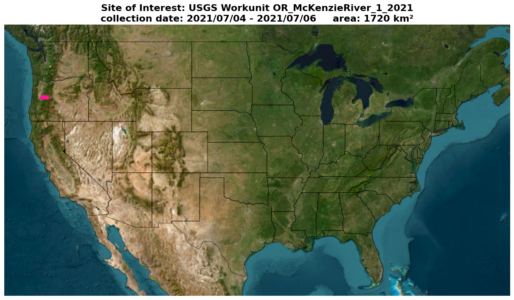
</p>

<div style="display: flex; flex-wrap: nowrap; align-items: flex-start; min-width: 1200px;">
  <div style="flex: 0 0 60%; max-width: 60%;">
    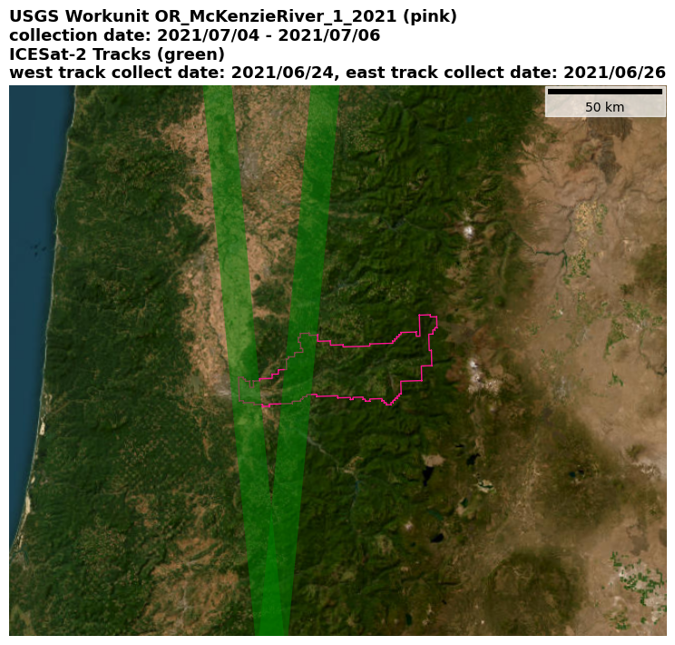
  </div>
  <div style="flex: 0 0 40%; max-width: 40%; padding-left: 20px;">
    <p>
      The USGS flight, or our "ground truth" elevation data for the sake of this project, was flown in July 2021 with a 2-day acquisition window. This site was selected due to its short acquisition window and near-contemporaneous overlap with two separate ICESat-2 tracks, both collected less than two weeks before in late June of 2021. There are likely better candidates—sites with more diverse terrain and landcover with less temporal decorrelation relative to ICESat-2 acquisitions—but for the sake of time for this final project, this site was settled on. The USGS extent spans over 1700km2 and the estimated overlap area (via ICESat-2 track geometry clipped with the USGS extent in the respective UTM crs) is roughly 400km2. The two ICESat-2 granules of interest are ATL06_20210624003626_00061202_006_01 (west track) and ATL06_20210626124356_00441206_006_01 (east track).
    </p>
  </div>
</div>

The spatiotemporal metadata for OR_McKenzieRiver_1_2021 was accessed via the [coincident](https://coincident.readthedocs.io/en/latest/) Python package which leverages the USGS 3DEP Work Unit Extent Spatial Metadata ([WESM](https://www.usgs.gov/ngp-standards-and-specifications/wesm-data-dictionary)). The ICESat-2 granules were accessed via the SpatioTemporal Asset Catalog ([STAC](https://stacspec.org/en)) at `"https://cmr.earthdata.nasa.gov/stac/NSIDC_ECS"` as seen by the [misc/stac_helper.py](https://github.com/UW-GDA/ATL06_LaserLottery/blob/main/misc/stac_helper.py) module.

#### [notebooks/01_prelim_results.ipynb](https://github.com/UW-GDA/ATL06_LaserLottery/blob/main/notebooks/01_prelim_results.ipynb) showcases some contextual data for our site and the USGS and ICESat-2 default ATL06 product. 
The USGS-provided DEM was downloaded locally via [misc/usgs_tile_mosaic.sh](https://github.com/UW-GDA/ATL06_LaserLottery/blob/main/misc/usgs_tile_mosaic.sh). It would be ideal to sample these values on the fly when evaluating ICESat-2 elevations, but this was not possible due to time constraints. I have a framework for this on-demand sampling as seen [here](https://github.com/uw-cryo/coincident/commit/7ad9400b43c84f65e7366f21c8b9076cdd2002f6) using odc stac and rioxarray with the [TNM API](https://apps.nationalmap.gov/tnmaccess/), but was unable to clean up the efficiency of the sampling to make it usable for our gridsearch context in time for this project deadline. 

[SlideRule](https://slideruleearth.io/) provides fast, on-demand USGS 3DEP sampling as seen [here](https://github.com/SlideRuleEarth/sliderule/tree/396fb6f85ea46b97cad43e367107811ae9664f33/datasets/usgs3dep/package), but this sampling was too unreliable and didn't fit the context of our problem well enough. Namely, the SlideRule 3DEP sampling samples on a point geometry. Given that ATL06 typically has a footprint of 40m or 30m in our context, a 3DEP sample from a 1m raster cell at the centroid of the footprint would be unrepresentative for comparative purposes. Additionally, I found when using the SlideRule sampling tool that it did not reliably sample every ICESat-2 point within valid USGS 3DEP DEM bounds. I'm unsure of why this is mainly as I don't understand the C programming language (which is what their sampling code is written in), but this is something to look into a raise an issue about on their repo. Thus, we proceeded with our locally downloaded data.

We mosaic the tiled data, perform a 3D CRS transformation from src crs `"EPSG:6557+8228"` to target crs `"EPSG:32610+4979"` so elevation values are represented in meters above the wgs ellipsoid like the ICESat-2 data, and coarsen it to 10mx10m resolution from 1mx1m resolution to speed up processing time of future computations.

USGS DEM Terrain | USGS DEM Terrain Hist
:-------------------------:|:-------------------------:
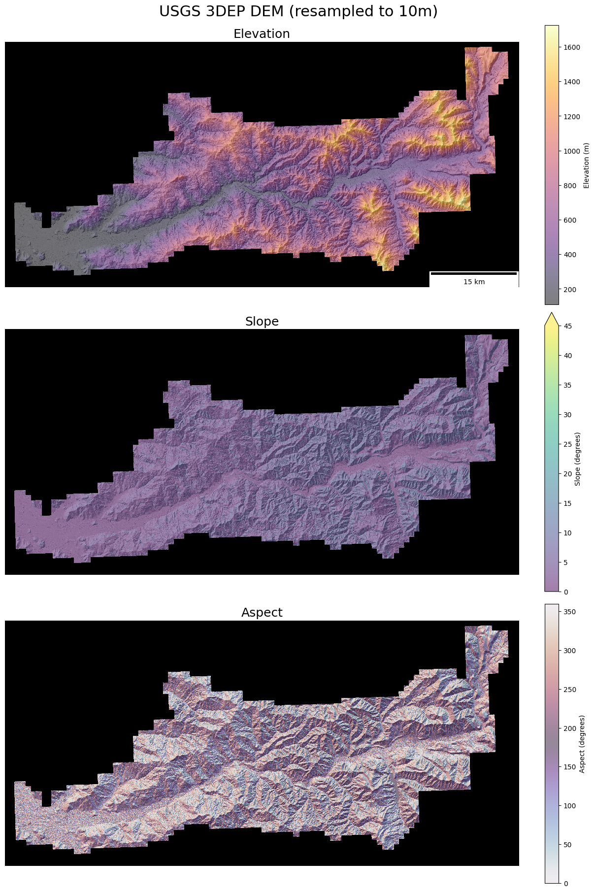 | 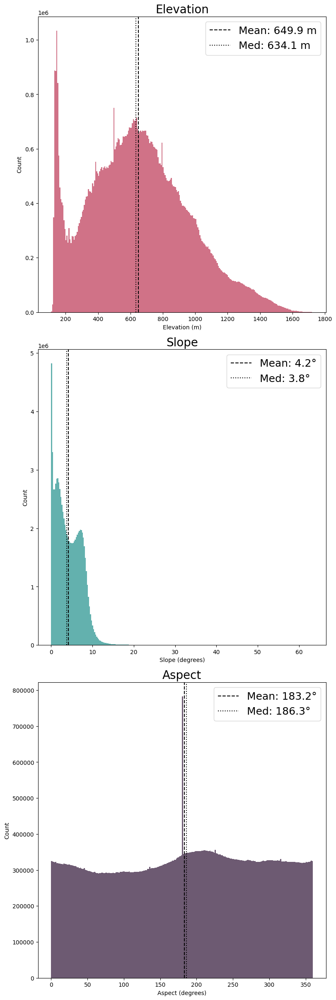

The ICESat-2 data was processed with SlideRule as seen by the wrapper in the module at [misc/sr_wrapper.py](https://github.com/UW-GDA/ATL06_LaserLottery/blob/main/misc/sr_wrapper.py). "Default" ATL06 parameters are defined from [SlideRule's documentation](https://nbviewer.org/github/ICESat2-SlideRule/sliderule-python/blob/main/examples/boulder_watershed_demo.ipynb) where our default processing parameters are seen below:

```
"srt": icesat2.SRT_LAND,
"cnf": icesat2.CNF_SURFACE_HIGH,
"ats": 10.0,
"cnt": 10,
"len": 40.0,
"res": 20.0,
"geoid": True,
"vars": ["h_mean", "latitude", "longitude", "h_sigma", "quality_summary"]
```

Default ATL06 h_mean Values | Zoomed Extent
:-------------------------:|:-------------------------:
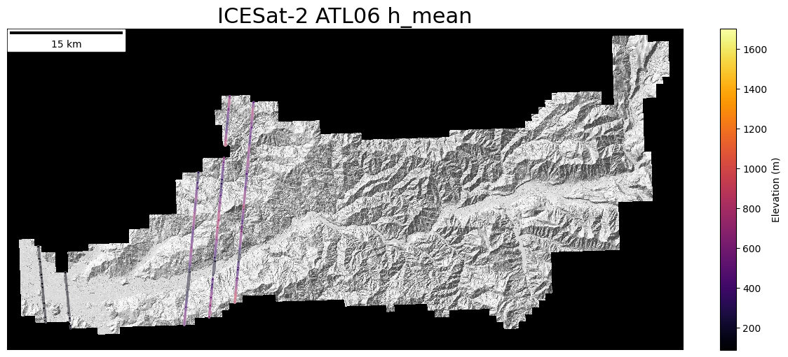 | 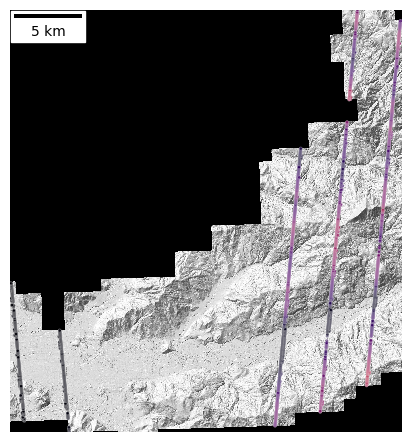

Respective 3DEP elevation data was then sampled and difference for every ATL06 value. This was done in an inefficient `for loop` as the mentioned on-demand sampling via odc stac is still a work in progress. In this sampling, every geometry in the ATL06 geodataframe is buffered to a 40x40m square, and overlapping grid cells from the 10x10m 3DEP DEM are averaged with `np.nanmean()` and recorded. These respective 3DEP elevation values are then subtracted from the ICESat-2 values (h_mean minus 3DEP elevation). This workflow can be found in [line 83](https://github.com/UW-GDA/ATL06_LaserLottery/blob/main/misc/atl06_gridsearch.py#L83) of misc/atl06_gridsearch.py.

A Sentinel-2 image from Planetary Computer was brought in for interpretation of the differences over a brightened RGB image (resampled to 20x20m resolution). This image was captured on 2021-06-26 and selected due to the low cloud coverage in the scene and temporal proximity to the ICESat-2 acquisitions. Additional contextual data from the [NLCD 2021](https://www.mrlc.gov/data/legends/national-land-cover-database-class-legend-and-description) mission (10x10m) was brought in for the scene via the [easysnowdata](https://egagli.github.io/easysnowdata/examples/remote_sensing_examples/?h=nlcd#nlcd-landcover-2021) Python package.

Default ATL06 h_mean minus 3DEP Elevations | Contextual Data
:-------------------------:|:-------------------------:
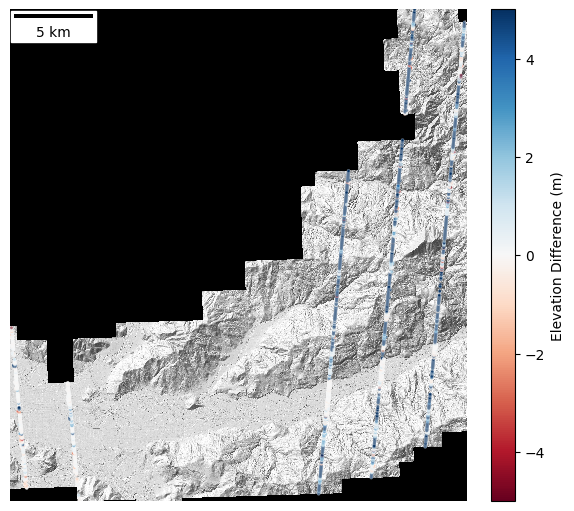 | 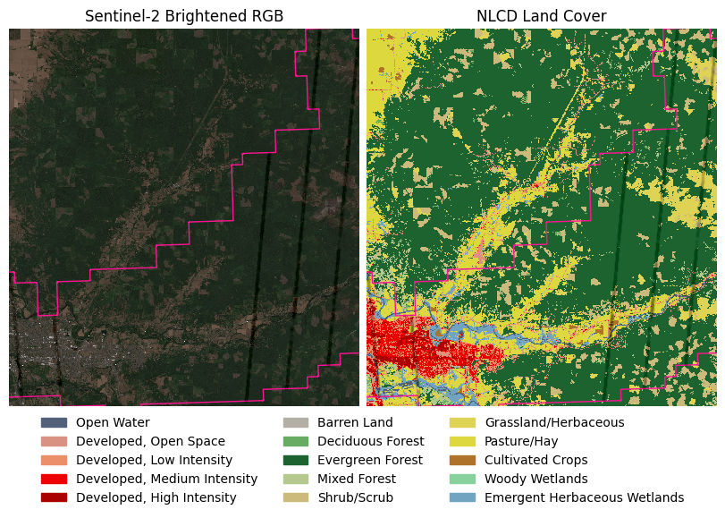

We can already see the drastic overestimation of ICESat-2 over the areas of high slope and forest coverage via manual interpretation, at over 5 meters of bias. We have to understand that we're in dense coniferous forests in the southern Cascades where we see these differences, a challenging area to gather accurate LIDAR measurements. 

<p align="center">
  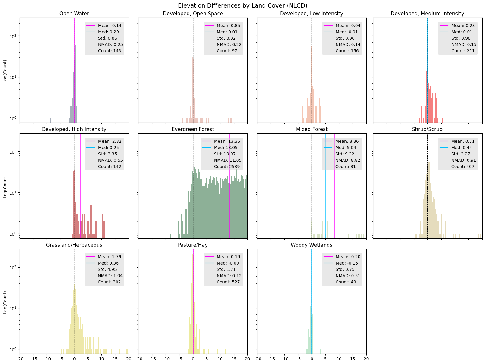
</p>

Our histograms of elevation differences above, grouped by landcover values for the NLCD 2021 data, reveal that our bias is actually 10s of meters for evergreen forests. Sampling for each point's respective NLCD class value can be found at [misc/nlcd_sample.py](https://github.com/UW-GDA/ATL06_LaserLottery/blob/main/misc/nlcd_sample.py). For this, we sampled points rather than the footprints for efficiency sake. Ideally, we would use the same 40m footprints as we did for the 3DEP elevation sampling and assign land cover values based on the class of pixels that appears most in that 40m overlap.

This discrepancy between elevation difference biases per land cover class is further accentuated when we focus on a singular beam from our ICESat-2 data.

<p align="center">
  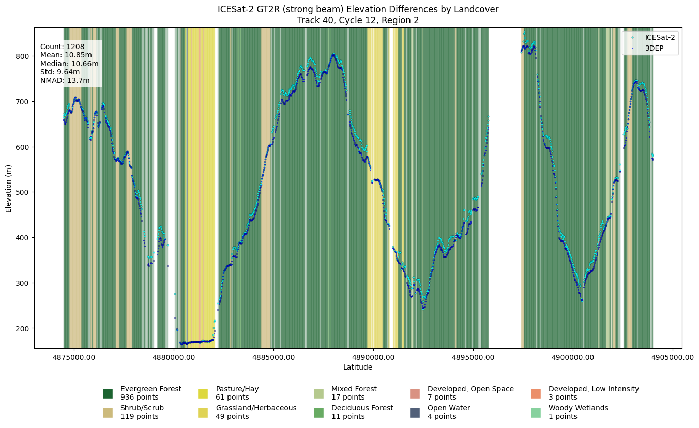
</p>

In the above image, we see ICESat-2 elevation measurements from the most-eastward beam (which is a "strong" beam) and respectively sampled 3DEP elevation value where our x-axis is the along-track distance of the beam. Behind each elevation measurement is the sampled NLCD land cover class for the respective ATL06 point. The plot highlights the stark constrast in elevation differences; ATL06 measurements over evergreen forests close in proximity to non-forested areas have an significant visual bias in the elevation measurement compared to the neighboring non-forested area.

#### [notebooks/02_gridsearch_results.ipynb](https://github.com/UW-GDA/ATL06_LaserLottery/blob/main/notebooks/02_gridsearch_results.ipynb) shows results from our ATL06 parameter gridsearch processed at [misc/atl06_gridsearch.py](https://github.com/UW-GDA/ATL06_LaserLottery/blob/main/misc/atl06_gridsearch.py). 
The gridsearch for different ATL06 processing parameters was messy both in terms of parameter space selection and land cover sampling, but these are both easy fixes for future work. We initially perform the gridsearch for 16 different parameter combinations where the results are the standard ATL06 variables returned from the SlideRule ATL06 call along with the sampled 3DEP elevations and elevation differences. Every one of these outputs (a geodataframe of the ATL06 data) is saved as a parquet in [data/OR_McKenzieRiver_1_2021_atl06](https://github.com/UW-GDA/ATL06_LaserLottery/tree/main/data/OR_McKenzieRiver_1_2021_atl06). The parameter search space includes every unique combination of:

```
    len_values = [30.0, 40.0]      # 'len': length parameter in meters
    res_values = [10.0, 20.0]      # 'res': resolution parameter in meters
    cnt_values = [5, 10]           # 'cnt': count parameter
    ats_values = [5.0, 10.0]       # 'ats': ats parameter
```

Where:

| **Parameter**          | **Description**                                                                                                                                                                                                                                                                                       |
|------------------------|---------------------------------------------------------------------------------------------------------------------------------------------------------------------------------------------------------------------------------------------------------------------------------------------------------|
| **len (Length)**       | Sets the ground length (in meters) of each extent. For example, with a len of 40 m, all photons captured along a 40 m stretch are grouped together.                                                  |
| **res (Resolution/Step)** | Specifies the spacing between the centers of consecutive extents along track. When res is smaller than len, segments overlap. For instance, a 40 m segment with a 20 m step produces a 50% overlap, while a 30 m segment with a 10 m step results in even more overlap.                        |
| **cnt (Count)**        | Defines the minimum number of photons required in an extent for it to be valid. For example, if cnt is set to 10, any 40 m segment must contain at least 10 photons; lowering cnt to 5 may help in low-signal conditions.                                                                          |
| **ats (Along-Track Spread)** | Requires that the photons in an extent span a minimum distance along the track, ensuring they aren’t too clustered. For instance, an ats of 10 m means the photons must cover at least 10 m of the extent. Lowering this value (e.g., to 5 m) relaxes the requirement. |

ATL06 'len' example (40m)
:-------------------------:
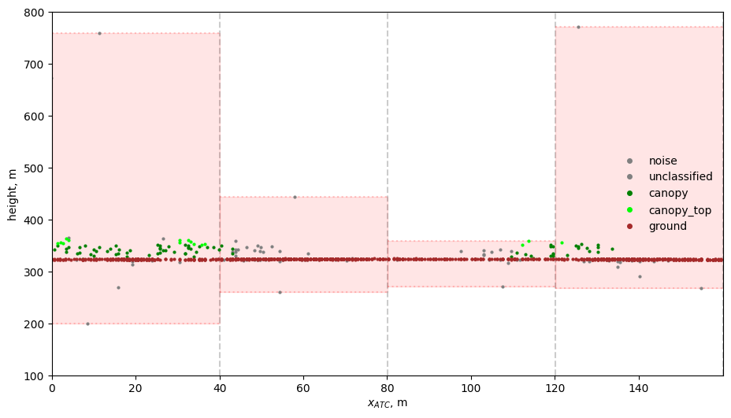

ATL06 'res' example (len=40, res=20)
:-------------------------:
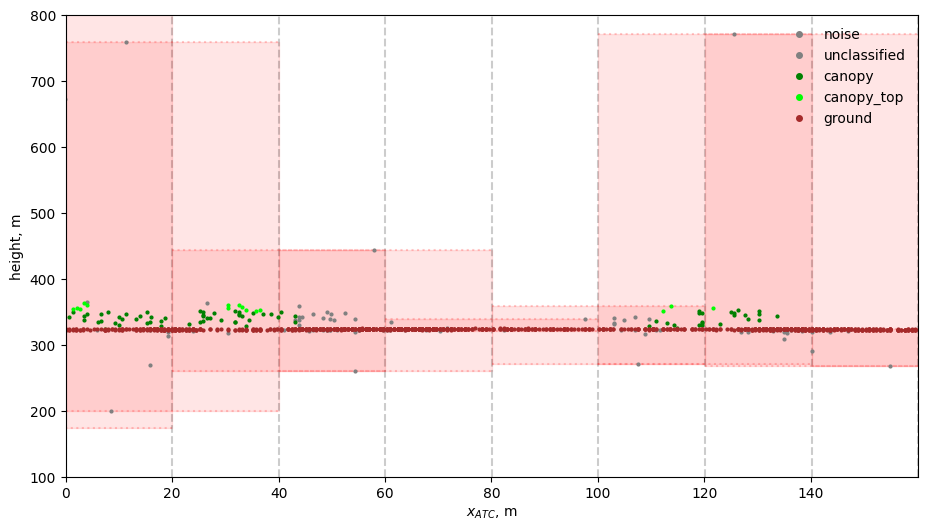

ATL06 'cnt' example | ATL06 'cnt' removal (segment 2 didn't satisfy the cnt parameter)
:-------------------------:|:-------------------------:
 | 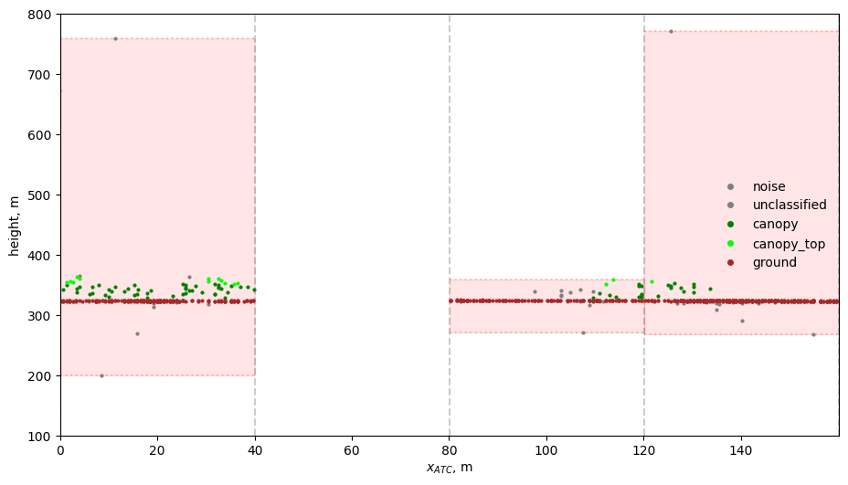

ATL06 'ats' example | ATL06 'ats' removal (segment 2 didn't satisfy the ats parameter)
:-------------------------:|:-------------------------:
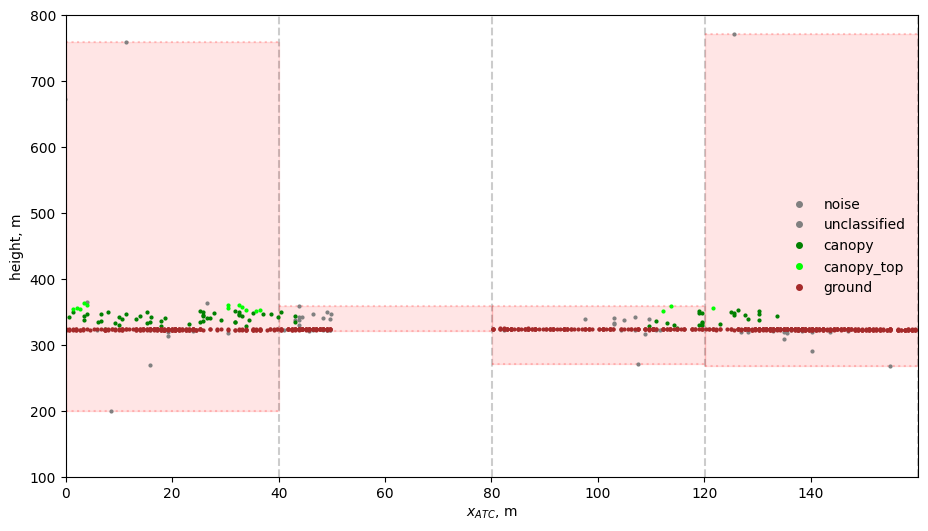 | 

In addition to these four parameters, the full SlideRule ATL06 processing workflow has many other parameters that affect photon selection and elevation estimation. In total, there are over 20 configurable parameters that range from photon classification to the iterative fitting process. For example, some of the ones I'd be curious to explore in the future include:

| **Parameter**               | **Description**                                                                                                                        |
|-----------------------------|----------------------------------------------------------------------------------------------------------------------------------------|
| **ATL08_class**             | Determines the ATL08-based classification of photons, which is crucial when processing vegetation or mixed land cover.                 |
| **cnf (Confidence)**        | Sets the minimum confidence level a photon must have to be considered a valid signal.                                                  |
| **maxi (Maximum Iterations)** | Controls the maximum number of iterations used to refine the photon-selection window.                                                  |
| **H_min_win (Min Window Height)** | Sets a lower limit on how much the photon-selection window can contract during processing.                                           |
| **sigma_r_max**             | Specifies the maximum robust dispersion allowed for the fitted segment.                                                                |

Our initial grid search only varied four parameters (len, res, cnt, ats) because we wanted a manageable search space given our limited time. However, the selected parameter space did not nearly capture the complexity of the algorithm. In our results, all combinations with a len of 30 produced identical outputs, and the same was true for those with a len of 40. This suggests that segment length (len) is the dominant factor in determining the output, while the effects of res, cnt, and ats were minimal within the tested range. In future work, we hope to expand the grid search to include additional parameters.

<p align="center">
  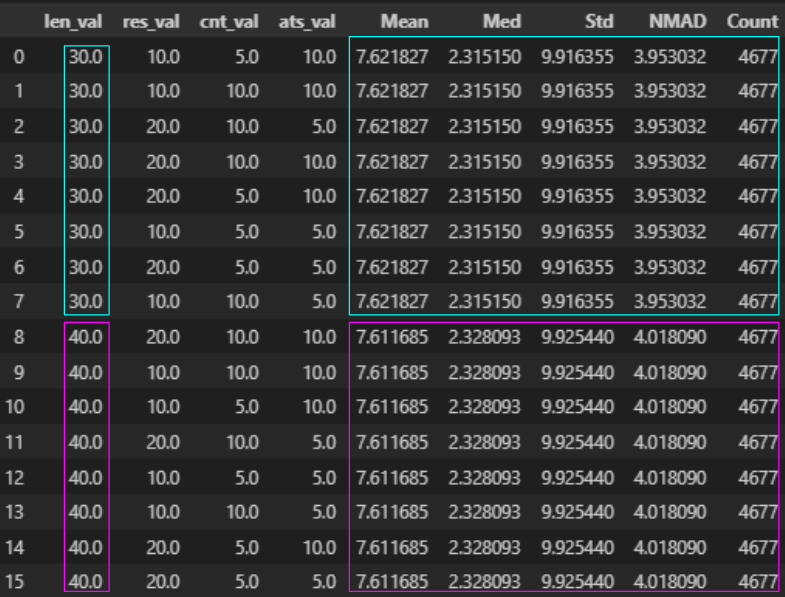
</p>

Additionally, the sampling for NLCD values occured after our grid search in yet another `for loop`. This loop only took one second, though, and is easily implementable to the broader script. In this loop, we read in the parquet files at [data/OR_McKenzieRiver_1_2021_atl06](https://github.com/UW-GDA/ATL06_LaserLottery/tree/main/data/OR_McKenzieRiver_1_2021_atl06), sample the NLCD value and label at every point in the geodataframe and add those values as new columns, and write our results to new parquet files at [data/OR_McKenzieRiver_1_2021_gridsearch](https://github.com/UW-GDA/ATL06_LaserLottery/tree/main/data/OR_McKenzieRiver_1_2021_gridsearch).

Due to the fact that we only had two results to compare (the identical results of parameter combinations with a len=30 vs those with a len=40), analysis here is lackluster. These two results had a median elevation difference of 2.32 vs 2.33 meters, so we didn't want to spend much time diving into the differences here given the time constraints. Instead, we ensure good documentation and reproduceable code so that we, and others, can proceed with this work understanding the mistakes we made in our parameter space. There are is a boxplot exploration and helper functions for additional analysis in this notebook and in [misc/nlcd_plot.py](https://github.com/UW-GDA/ATL06_LaserLottery/blob/main/misc/nlcd_plot.py).

#### [notebooks/03_future_sites.ipynb](https://github.com/UW-GDA/ATL06_LaserLottery/blob/main/notebooks/03_future_sites.ipynb) quantifies how this analysis can be expanded beyond our site and scaled up.
Here, we read in local data that contains spatiotemporal metadata on [NCALM](https://ncalm.cive.uh.edu/), [NOAA](https://coast.noaa.gov/digitalcoast/data/coastallidar.html), and [NEON](https://www.neonscience.org/data-collection/lidar) LiDAR products. This abbreviated search finds aerial LiDAR sites from these three providers, and USGS 3DEP, that have near-contemporaneous overlap with ICESat-2 data.

<p align="center">
  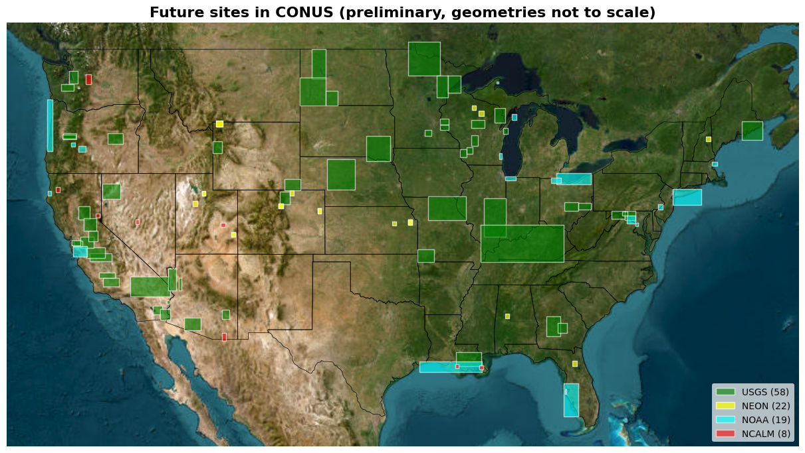
</p>

We see from the above map that we already have nearly 100 additional sites to inspect in CONUS alone, providing potential analysis over more diverse terrain and land cover. The NCALM, NOAA, and NEON catalogs were selected based on a minimum overlap area of 10km2 between aerial LiDAR flight area and ICESat-2 tracks. All catalogs were restricted so aerial LiDAR flights of interest had a maximum duration of 30 days (took <31 days to collect the LiDAR data). ICESat-2 data was only considered valid if it was captured between +- 15 days of the center of the acquisition period of the respective aerial LiDAR site, so all acquisitions had to be within the same month timeframe. USGS 3DEP had a minimum overlap area of 30km2 and was limited only to 2021 for visualization purposes, otherwise there would have been too many results.

This is just to quantify how many fortuitously, near-contemporaneous ICESat-2 and aerial LiDAR overlapping acquisitions there are. Ideally, we could reduce the acquisition times to be within a couple of days of the respective data sources and expand this to an international search.

## **Background**  
Launched on **September 15, 2018**, **[ICESat-2](https://icesat-2.gsfc.nasa.gov/)** is a NASA satellite that measures global elevation using the **Advanced Topographic Laser Altimeter System (ATLAS)**. ATLAS fires **10,000 laser pulses per second**, each containing **~300 trillion photons**, but only a handful return to the sensor. These photons are then processed by algorithms such as **ATL06**, which estimates land ice surface height by filtering noise and computing along- and across-track slopes.

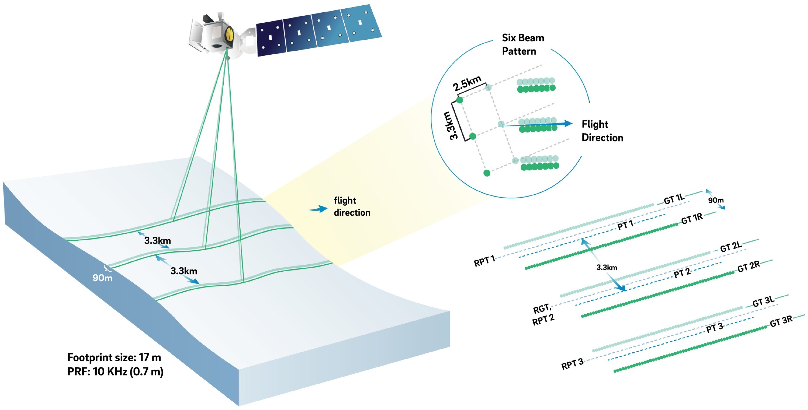  
*Figure: ICESat-2 beam configuration (Smith et al., 2019).*

ICESat-2 supports multiple applications through various data products, with a few listed below:  
- **ATL03:** Raw photon cloud data  
- **ATL06:** Land ice elevation (our focus)  
- **ATL08:** Canopy height and surface classification  
- **ATL13:** Inland water surface heights  

For more details, see the **[ICESat-2 Data Products](https://icesat-2.gsfc.nasa.gov/science/data-products)**.

## **Problem Statement & Objectives**  
Accurate and high-resolution topographic data are crucial for understanding Earth’s **dynamic surface processes**, including **glacier retreat, vegetation structure, and elevation changes**. The **National Academy of Sciences’ 2017–2027 Decadal Survey for Earth Observation** identified these datasets as priority observables for NASA Earth Science ([National Academies, 2018](https://doi.org/10.17226/24938)). In response, NASA’s **Surface Topography and Vegetation (STV) Incubation Program** aims to develop **next-generation multi-modal elevation datasets** by integrating **satellite and airborne data**.

Unlike past efforts such as **SRTM (Shuttle Radar Topography Mission)**, which provided a near-global topographic dataset over 11 days in 2001, STV seeks to **fuse elevation measurements from lidar, optical stereo, and synthetic aperture radar (SAR)** collected at different times. This integration introduces several challenges:
- **Variability in measurement techniques** (e.g., photon-counting lidar vs. radar)
- **Differences in spatial resolution and sensor geometry**
- **Real surface changes over time** (e.g., vegetation growth, ice melt)

Given the limited scope of our final project, we're mainly concerned with the question **what biases are introduced by different ATL06 processing parameters, how do these biases change over varying terrain and land cover characteristics, and why?**

Why ATL06? This has become the runaway algorithm to use for processing ICESat-2 data for a wide range of applications such as forest management, water resources, urban development, and more
* Vegetation canopy height measurements (H. Travers-Smith et al., 2024) https://doi.org/10.1016/j.rse.2024.114097
* Meltwater Depth Estimates (Fricker et al., 2020) https://doi.org/10.1029/2020GL090550
* Forest biomass estimation (Duncanson et al., 2020) https://doi.org/10.1016/j.rse.2020.111779
* Urban elevation modeling (Lao et al., 2021) https://doi.org/10.1016/j.jag.2021.102596

Despite this, ATL06's **performance and biases** in non-glacial environments remain **poorly understood**. Comparing customized ATL06 photon processing methods, using the "standard" ATL06 processing as reference, is essential to:
- **Identify systematic biases** in ICESat-2’s elevation products
- **Understand why ATL06-derived elevations disagree with other altimetry sources** 
- **Improve the accuracy of fused elevation datasets for STV**

In the context of our project, we will hone in on understanding why ATL06-derived elevations disagree with "ground truth" altimetry derived from aerial LiDAR DEMs over differing vegetation. These DEMs are genereated from the USGS 3DEP program and are commonly used as "ground truth" reference for elevation/altimetry comparison studies. We hope to gather diverse samples of ATL06 measurements across diverse vegetation types over the contiguous US. We will evaluate the performance over various custom ATL06 processing algorithms over these sites. These sites have been chosen to eliminate temporal decorrelation between ICESat-2 and the reference DEMs, where ICESat-2 points are within 14 days of the USGS DEM acquisition date.

Despite this hope, we ended up only working on a singular site due to time contraints, but this work is scalable.

## **Datasets**  
We will analyze ICESat-2 elevation data alongside:  
- **[USGS 3DEP Aerial LiDAR DEMs](https://www.usgs.gov/3d-elevation-program)** – High-resolution airborne LiDAR DEMs treated as "ground truth" elevation. 
- **[NLCD LULC 2021](https://www.mrlc.gov/data/nlcd-2021-land-cover-conus)** – 2021 National Land Cover Database product. Includes [diverse characterizations of land cover](https://www.mrlc.gov/data/legends/national-land-cover-database-class-legend-and-description), processed by the USGS partnered with other federal insitutions by [running unsupervised clustering algorithms on Landsat data](https://www.gismanual.com/earthshelter/National%20Land-Cover%20Dataset%20(NLCD)%20Metadata%20%20US%20EPA.htm#:~:text=The%20general%20NLCD%20procedure%20is,ancillary%20data%20source(s)%2C).

## **Tools & Software**  
We will leverage multiple tools to process and analyze the data, the main packages being:  
- **[SlideRule](https://slideruleearth.io/)** – Cloud-based ICESat-2 processing framework, supporting both standard and **custom algorithms**.   
- **[GeoPandas](https://geopandas.org/)** – Used for spatial data analysis for our ICESat-2 points and other relevant vector geometries.  
- **[Xarray](https://docs.xarray.dev/en/stable/)** – Used for handling multi-dimensional elevation datasets and other relevant rasters and nDarrays.  
- **[Coincident](https://coincident.readthedocs.io/en/latest/)** – Used to fetch relevant spatiotemporal metadata for 3DEP products and serves as an inspiration for our own custom processing in terms of STAC searches and SlideRule calls.
- **[easysnowdata](https://egagli.github.io/easysnowdata/)** – Used for grabbing NLCD data thanks to my favorite 5th year grad student 👉👈🥰.

## **Methodology**  
1. **Preprocess Differing Elevation Measurement Sources** – Retrieve 3DEP and ICESat-2 default ATL06 elevations over our site.
2. **Apply Custom Photon-Counting Algorithms** – Implement alternative processing methods in SlideRule via gridsearch.  
3. **Compare with Reference Datasets** – Validate against USGS 3DEP DEMs.
4. **Tie Findings into NASA’s STV Framework** – Assess notable biases and how different processing approaches fit into broader Earth observation objectives.

## **Expected Outcomes**  
- Identification of vegetation where **custom photon-counting algorithms** outperform standard ATL06 processing.  
- Insights into **vegetation-dependent biases** in ICESat-2 elevation retrievals.  
- Contributions to NASA’s **STV Incubation program** for **multi-modal elevation fusion**.  

## **Related Work**  
- **[ICESAT-2 HackWeek: Surfit](https://github.com/ICESAT-2HackWeek/surfit)** – Prior work on surface fitting algorithms for ICESat-2.  
- **[ICESat-2 Data Portal](https://icesat-2.gsfc.nasa.gov/)** – Official mission website.  
- **[ICESat-2 Land Ice Elevation Paper](https://www.sciencedirect.com/science/article/pii/S0034425719303712)** – Foundational ICESat-2 paper.
- **[ICESat-2 Canopy Height Evaluation Paper](https://www.sciencedirect.com/science/article/pii/S0034425721004314)** – Similar work comparing ATL08 algorithms for canopy height.

## **References**  
- **National Academies of Sciences, Engineering, and Medicine (2018).** *Thriving on Our Changing Planet: A Decadal Strategy for Earth Observation from Space.* [DOI: 10.17226/24938](https://doi.org/10.17226/24938).  
- **Donnellan, A. (2021).** *Observing Earth's Surface Topography and Vegetation Structure in the Next Decade.* [AGU U32A-01](https://agu.confex.com/agu/fm21/meetingapp.cgi/Paper/940395).  
- **Farr, T. (2007).** *Shuttle Radar Topography Mission (SRTM) Data Processing and Applications.*  

---  
### *Because counting photons is more complicated than it sounds*  🚀❄️
